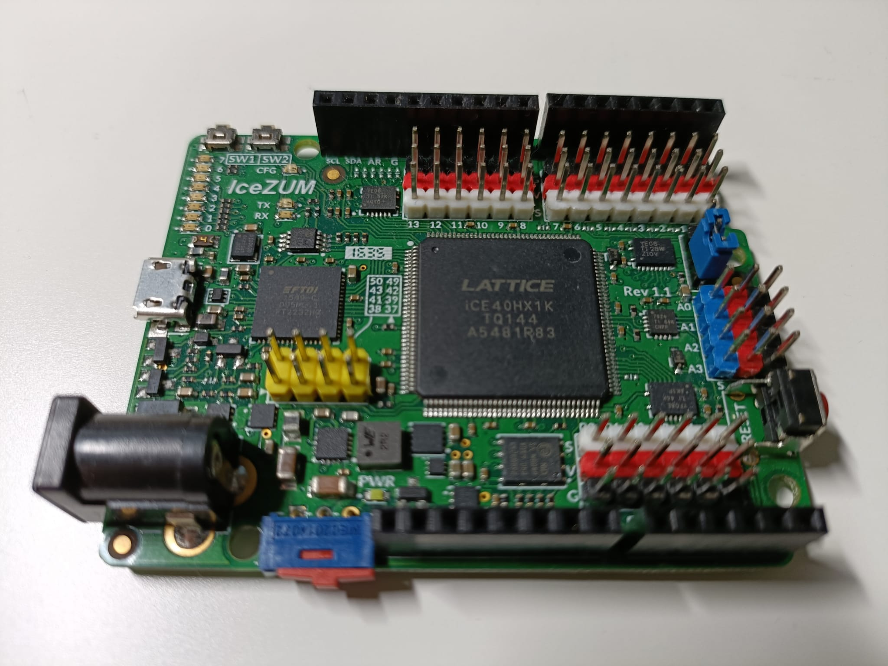
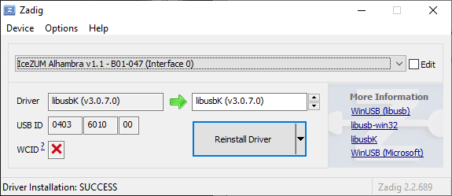
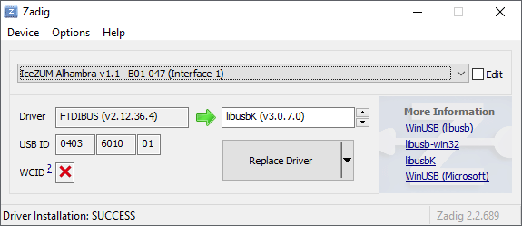
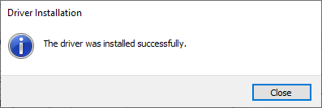

# icezum-digital-design
Design of digital circuits on the FPGA Icezum Alhambra

## Overview



## Required Software Installation

### Icarus Verilog
[Icarus](https://bleyer.org/icarus/) is a free compiler implementation for the IEEE-1364 Verilog hardware description language.
Download and install the next version [iverilog-v12-20220611-x64_setup](https://bleyer.org/icarus/iverilog-v12-20220611-x64_setup.exe). 


### Apio
[Apio](https://github.com/FPGAwars/apio) is an open source ecosystem for open FPGA boards. Is a multiplatform toolbox, with static pre-built packages, project configuration tools and easy command interface to verify, synthesize, simulate and upload verilog dsigns.

```bash
pip install -U apio
apio install -all
```

## Quick Start

* Check your verilog code using [Icarus Verilog](https://bleyer.org/icarus/).
```bash
apio verify
```
* Simulate your test bench using [Icarus Verilog](https://bleyer.org/icarus/) and [GTKWave](https://gtkwave.sourceforge.net/)
```bash
apio sim
```
* Syntesize your project using [Icestorm Tools](https://clifford.at/icestorm)
```bash
apio build
```
* Enable FTDI drivers
```bash
apio drivers --ftdi-enable

Launch drivers configuration tool

   FTDI driver installation:
   Usage instructions

      1. Connect the FTDI FPGA board
      2. Select (Interface 0)
      3. Replace driver by "libusbK"
      4. Reconnect the board
      5. Check `apio system --lsftdi`
```




* Connect your FPGA board and upload the bitstream using [Icestorm Tools](https://clifford.at/icestorm)
```bash
apio upload
```
