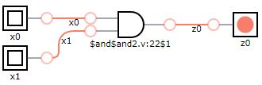
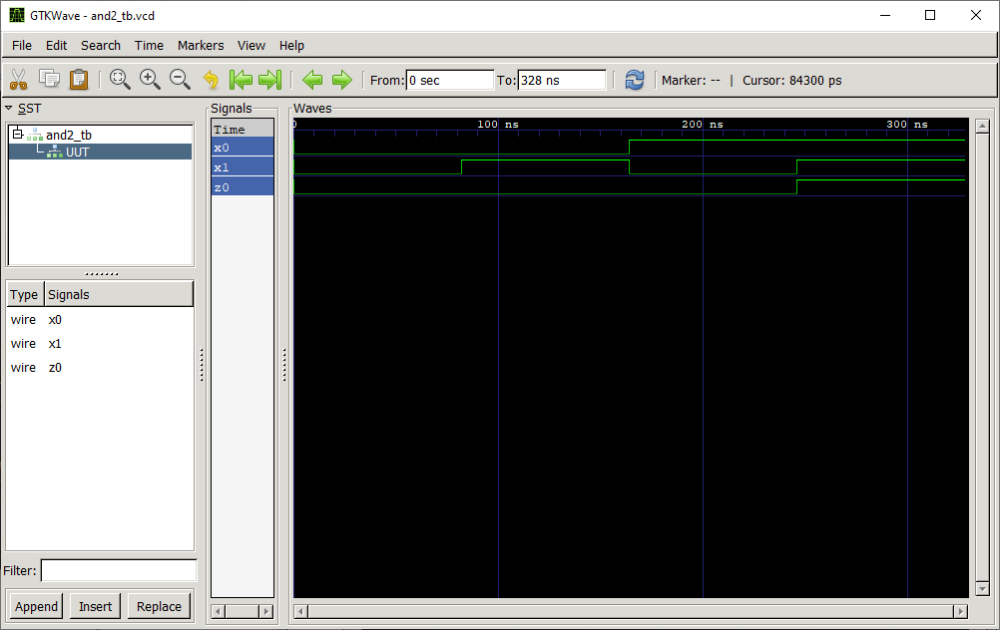

# AND 2:1 Gate

## Definition
The AND 2:1 gate is a basic digital logic gate that implements logical conjunction (∧) from mathematical logic.

### Truth Table
|x0 | x1 |z0 = f(x0,x1)|
|:---:|:---:|:---:|
|0| 0| 0|
|0| 1| 0|
|1| 0| 0|
|1| 1| 1|

## Test Bench

