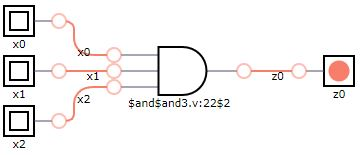
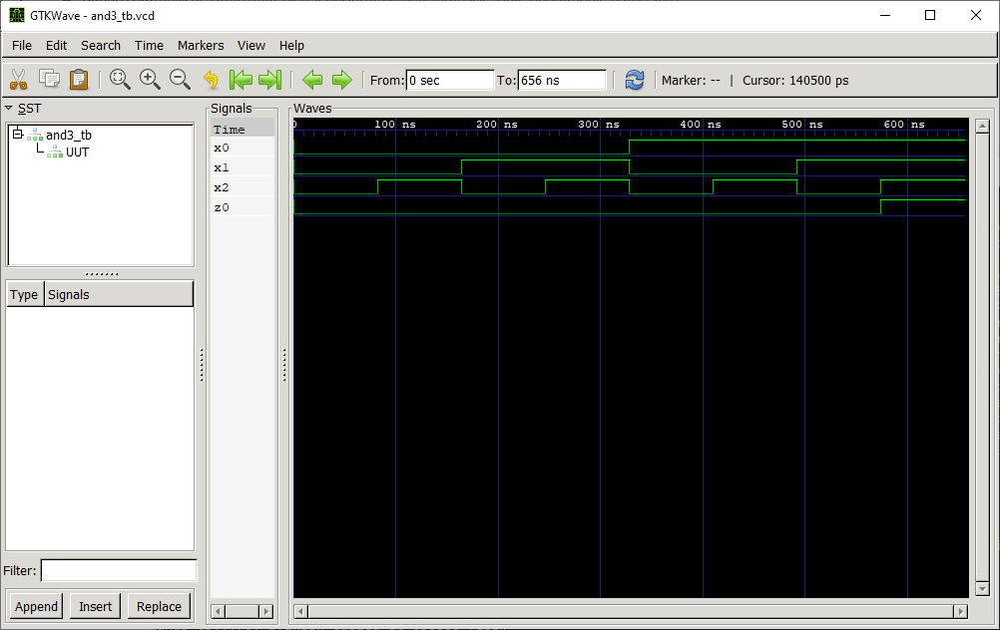

# AND 3:1 Gate

## Definition
The AND 3:1 gate is a basic digital logic gate that implements logical conjunction (∧) from mathematical logic. 

### Truth Table
|x0 | x1 | x2 |z0 = f(x0,x1,x2)|
|:---:|:---:|:---:|:---:|
|0| 0| 0| 0|
|0| 0| 1| 0|
|0| 1| 0| 0|
|0| 1| 1| 0|
|1| 0| 0| 0|
|1| 0| 1| 0|
|1| 1| 0| 0|
|1| 1| 1| 1|

## Test Bench

