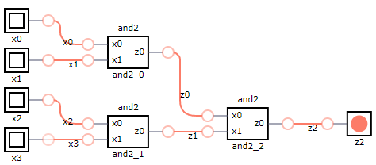
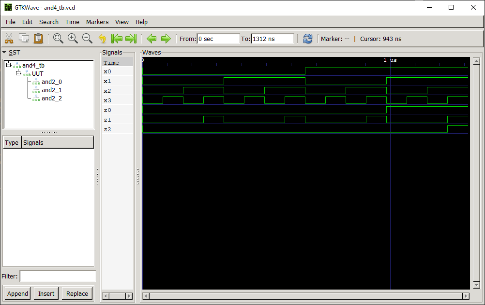

# AND 4:1 Gate

## Definition
The AND 4:1 gate is a basic digital logic gate that implements logical conjunction (∧) from mathematical logic.

### Truth Table
|x0 | x1 | x2 | x3 |z2 = f(x0,x1,x2,x3)|
|:---:|:---:|:---:|:---:|:---:|
| 0| 0| 0| 0| 0|
| 0| 0| 0| 1| 0|
| 0| 0| 1| 0| 0|
| 0| 0| 1| 1| 0|
| 0| 1| 0| 0| 0|
| 0| 1| 0| 1| 0|
| 0| 1| 1| 0| 0|
| 0| 1| 1| 1| 0|
| 1| 0| 0| 0| 0|
| 1| 0| 0| 1| 0|
| 1| 0| 1| 0| 0|
| 1| 0| 1| 1| 0|
| 1| 1| 0| 0| 0|
| 1| 1| 0| 1| 0|
| 1| 1| 1| 0| 0|
| 1| 1| 1| 1| 1|

## Test Bench

## Design
A modular design using three [AND 2:1](../and2/README.md) logic gates has been chosen to obtain the desired output.