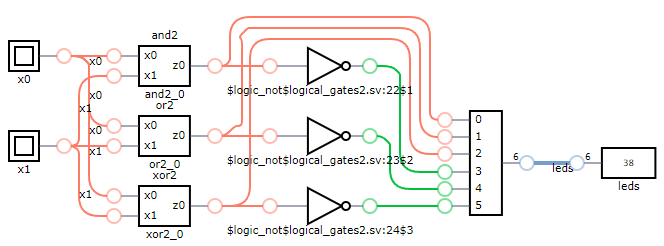
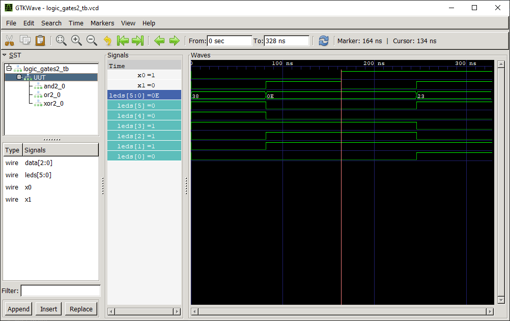

# Logic Gates 2:1

## Definition
Logic gates are the basic building blocks of any digital system. The next logic gates are used in this example: AND, OR, XOR, NAND, NOR, XNOR.

### AND 2:1 Truth Table
|x0 | x1 |z0 = f(x0,x1)|
|:---:|:---:|:---:|
|0| 0| 0|
|0| 1| 0|
|1| 0| 0|
|1| 1| 1|

### OR 2:1 Truth Table
|x0 | x1 |z0 = f(x0,x1)|
|:---:|:---:|:---:|
|0| 0| 0|
|0| 1| 1|
|1| 0| 1|
|1| 1| 1|

### XOR 2:1 Truth Table
|x0 | x1 |z0 = f(x0,x1)|
|:---:|:---:|:---:|
|0| 0| 0|
|0| 1| 1|
|1| 0| 1|
|1| 1| 0|

### NAND 2:1 Truth Table
|x0 | x1 |z0 = f(x0,x1)|
|:---:|:---:|:---:|
|0| 0| 1|
|0| 1| 1|
|1| 0| 1|
|1| 1| 0|

### NOR 2:1 Truth Table
|x0 | x1 |z0 = f(x0,x1)|
|:---:|:---:|:---:|
|0| 0| 1|
|0| 1| 0|
|1| 0| 0|
|1| 1| 0|

### XNOR 2:1 Truth Table
|x0 | x1 |z0 = f(x0,x1)|
|:---:|:---:|:---:|
|0| 0| 1|
|0| 1| 0|
|1| 0| 0|
|1| 1| 1|

## Test Bench

## Design

- The logic gate module [AND 2:1](../and2/README.md) has been chosen to obtain the desired output. In combination with an inverter, the **NAND** logic gate is obtained.

- The logic gate module [OR 2:1](../or2/README.md) has been chosen to obtain the desired output. In combination with an inverter, the **NOR** logic gate is obtained.

- The logic gate module [XOR 2:1](../xor2/README.md) has been chosen to obtain the desired output. In combination with an inverter, the **XNOR** logic gate is obtained.