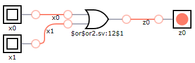
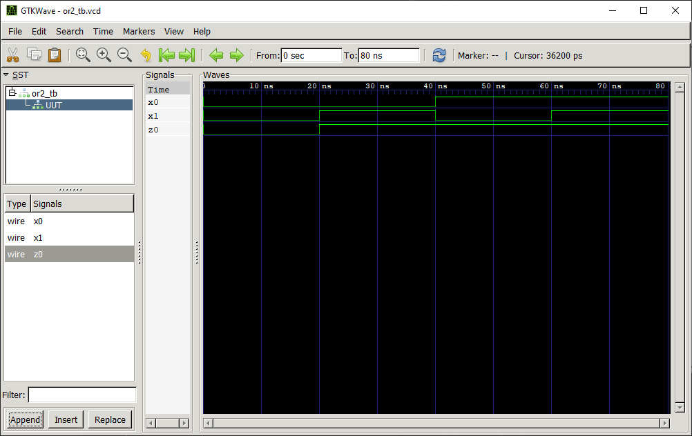

# OR 2:1 Gate

## Definition
The OR 2:1 gate is a basic digital logic gate that implements logical disjunction (∨) from mathematical logic. 

### Truth Table
|x0 | x1 |z0 = f(x0,x1)|
|:---:|:---:|:---:|
|0| 0| 0|
|0| 1| 1|
|1| 0| 1|
|1| 1| 1|

## Test Bench

