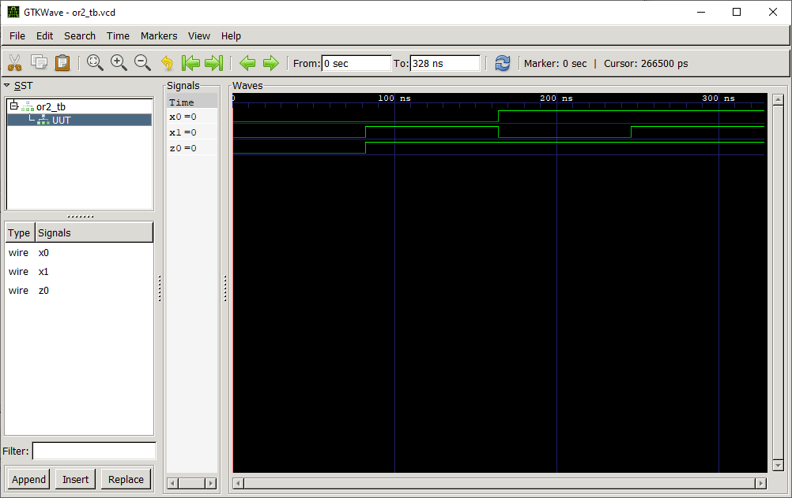

# OR2 Gate

## Definition
The OR gate is a basic digital logic gate that implements logical disjunction (∨) from mathematical logic. 

### Truth Table
|a | b |c = f(a,b)|
|:---:|:---:|:---:|
|0| 0| 0|
|0| 1| 1|
|1| 0| 1|
|1| 1| 1|

## Test Bench

