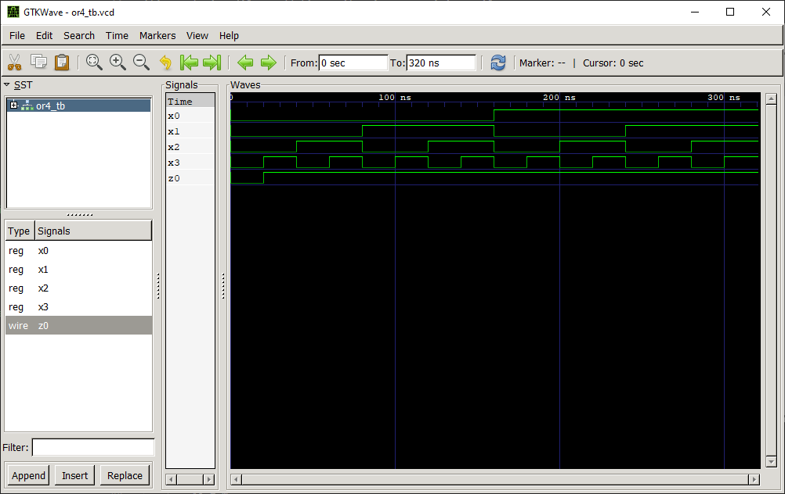

# OR4 Gate

## Definition
The OR gate is a basic digital logic gate that implements logical disjunction (∨) from mathematical logic. 

### Truth Table
|a | b | c | d | e = f(a,b,c,d)|
|:---:|:---:|:---:|:---:|:---:|
|0| 0| 0| 0| 0|
|0| 0| 0| 1| 1|
|0| 0| 1| 0| 1|
|0| 0| 1| 1| 1|
|0| 1| 0| 0| 1|
|0| 1| 0| 1| 1|
|0| 1| 1| 0| 1|
|0| 1| 1| 1| 1|
|1| 0| 0| 0| 1|
|1| 0| 0| 1| 1|
|1| 0| 1| 0| 1|
|1| 0| 1| 1| 1|
|1| 1| 0| 0| 1|
|1| 1| 0| 1| 1|
|1| 1| 1| 0| 1|
|1| 1| 1| 1| 1|

## Test Bench

