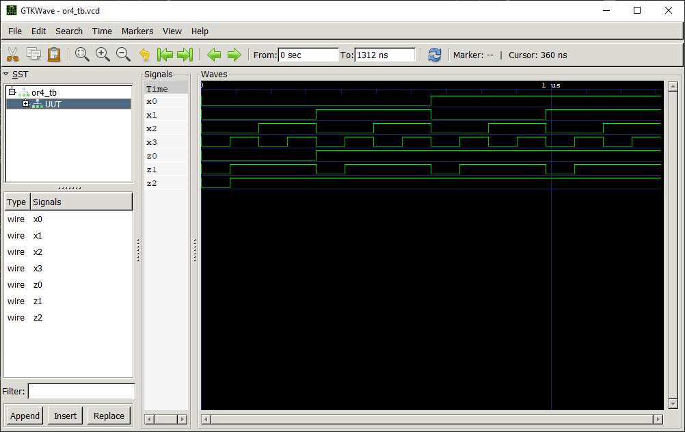

# OR 4:1 Gate

## Definition
The OR gate is a basic digital logic gate that implements logical disjunction (∨) from mathematical logic. 

### Truth Table
|x0 | x1 | x2 | x3 |z2 = f(x0,x1,x2,x3)|
|:---:|:---:|:---:|:---:|:---:|
|0| 0| 0| 0| 0|
|0| 0| 0| 1| 1|
|0| 0| 1| 0| 1|
|0| 0| 1| 1| 1|
|0| 1| 0| 0| 1|
|0| 1| 0| 1| 1|
|0| 1| 1| 0| 1|
|0| 1| 1| 1| 1|
|1| 0| 0| 0| 1|
|1| 0| 0| 1| 1|
|1| 0| 1| 0| 1|
|1| 0| 1| 1| 1|
|1| 1| 0| 0| 1|
|1| 1| 0| 1| 1|
|1| 1| 1| 0| 1|
|1| 1| 1| 1| 1|

## Test Bench

## Design
A modular design using three [OR 2:1](../or2/README.md) logic gates has been chosen to obtain the desired output.