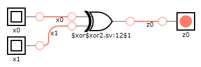
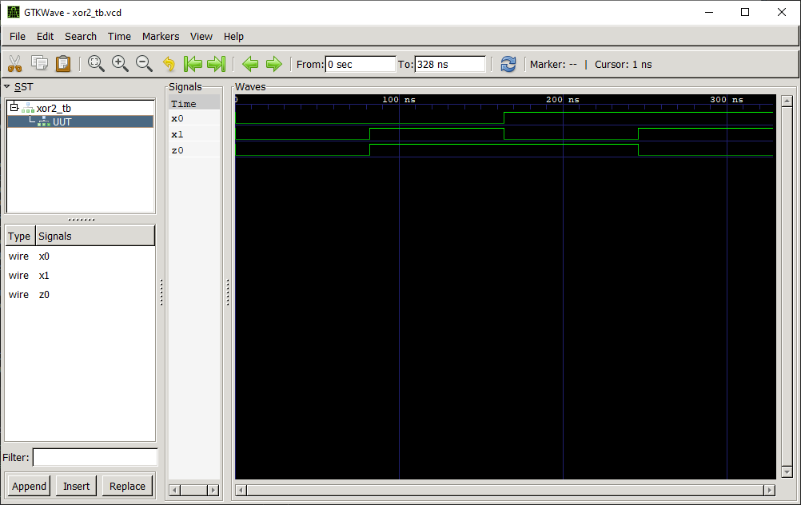

# XOR 2:1 Gate

## Definition
The XOR 2:1 gate is a basic digital logic gate that implements exclusive disjunction. 

### Truth Table
|x0 | x1 |z0 = f(x0,x1)|
|:---:|:---:|:---:|
|0| 0| 0|
|0| 1| 1|
|1| 0| 1|
|1| 1| 0|

## Test Bench

