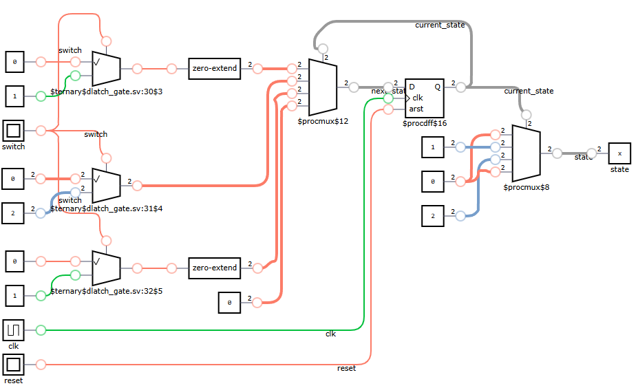

# Frequency Divider Module

## Definition
This is a Verilog module for a frequency divider, a digital circuit that takes an input clock signal (`clk_in`) 
and generates an output clock signal (`clk_out`) with a lower frequency with a 50% duty cycle. 
The division factor is configurable using a parameter (`DIV`).

### Inputs

* `clk_in`: Input clock signal.

### Parameters

* `DIV`: The division factor (default is `28'd30`). This defines the ratio of the input clock frequency to the output clock frequency.

### Output

* `clk_out`: Output clock signal, toggles at the divided frequency.

## Module Functionality
1. A 28-bit counter increments with each rising edge of the input clock (`clk_in`).
2. When the counter reaches `DIV - 1`, it resets to zero.
3. The output clock (`clk_out`) toggles:
   - `clk_out = 1` for the first half of the period.
   - `clk_out = 0` for the second half.

## Test Bench

## References
[FPGA Clock Divider Tutorial](https://www.fpga4student.com/2017/08/verilog-code-for-clock-divider-on-fpga.html)
