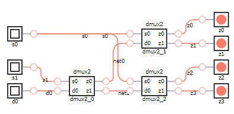

# DMUX 1:4 Multiplexer

## Definition
The demultiplexer (DMUX) is a combinational logic circuit that receives the information on a single input line and transmits the same information over one of n possible output lines. Demultiplexers, also called data distributors, transmit the same data wich is received at the input to different destinations.

This example designs a 1:4 demultiplexer using logic gates. This demultiplexer consists of two select inputs, one data input and four outputs. Depending on the select signals, the different outputs are activated. The signals are labeled in the following way:
* s0, s1: select input.
* d0: data input.
* z0, z1, z2, z3: data outputs.

### Truth Table
|s1 | s0 | d0 | z3 = f(s1,s0,d0) | z2 = f(s1,s0,d0)| z1 = f(s1,s0,d0) | z0 = f(s1,s0,d0) |
|:---:|:---:|:---:|:---:|:---:|:---:|:---:|
|0| 0| 0| 0| 0| 0| **0**|
|0| 0| 1| 0| 0| 0| **1**|
|0| 1| 0| 0| 0| **0**| 0|
|0| 1| 1| 0| 0| **1**| 0|
|1| 0| 0| 0| **0**| 0| 0|
|1| 0| 1| 0| **1**| 0| 0|
|1| 1| 0| **0**| 0| 0| 0|
|1| 1| 1| **1**| 0| 0| 0|

## Test Bench

## Design
A modular design using three [DMUX 1:2](../dmux2/README.md) has been chosen to obtain the desired output.
