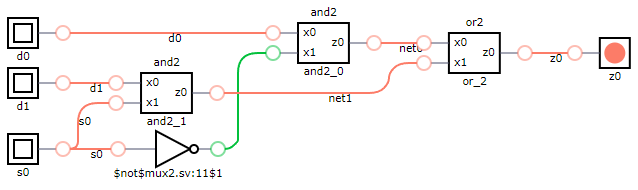
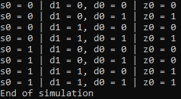

# MUX 2:1 Multiplexer

## Definition
The multiplexer (MUX) is a combinational logic circuit designed to switch one of several input lines through to a single common output line. Data input selection is controlled by a set of select inpucts that determine which data input is gated to the output. 

This example designs a 2:1 multiplexer using logic gates. This multiplexer consists of two inputs, one select input and one output. Depending on the select signal, the output is connected to either of the inputs. The signals are labeled in the following way:

* s0: select input.
* d0, d1: data inputs.
* z0: data output.

### Truth Table
|s0 | d0 | d1 |z0 = f(s0,d0,d1)|
|:---:|:---:|:---:|:---:|
|0| 0| x| 0|
|0| 1| x| 1|
|1| x| 0| 0|
|1| x| 1| 1|

## Test Bench

## Design
A modular design using two [AND 2:1](../and2/README.md) and one [OR 2:1](../or2/README.md) logic gates has been chosen to obtain the desired output.