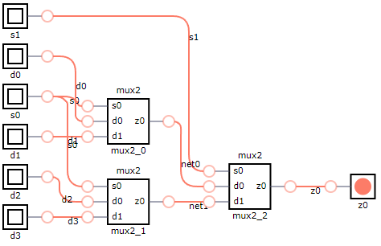
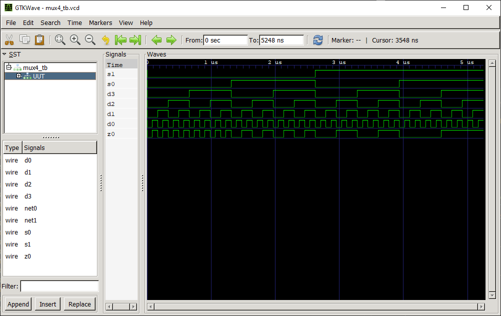
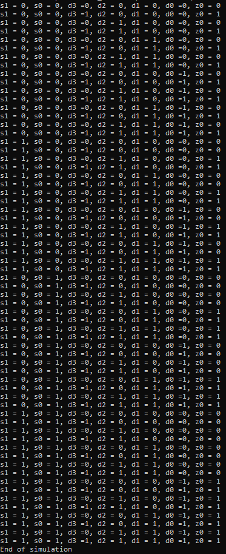

# MUX 4:1 Multiplexer

## Definition
The multiplexer (MUX) is a combinational logic circuit designed to switch one of several input lines through to a single common output line. Data input selection is controlled by a set of select inpucts that determine which data input is gated to the output. 

This example designs a 4:1 multiplexer using 2:1 multiplexers. This multiplexer consists of four data input lines, two select lines and one output. The signals are labeled in the following way:
* s0, s1: select inputs.
* d0, d1, d2, d3: data inputs.
* z0: data output.

### Truth Table
|s1 | s0 | d3 | d2 | d1 | d0 |z0 = f(s1,s0,d3,d2,d1,d0)|
|:---:|:---:|:---:|:---:|:---:|:---:|:---:|
|0| 0| 0| x| x| x| 0|
|0| 0| 1| x| x| x| 1|
|0| 1| x| 0| x| x| 0|
|0| 1| x| 1| x| x| 1|
|1| 0| x| x| 0| x| 0|
|1| 0| x| x| 1| x| 1|
|1| 1| x| x| x| 0| 0|
|1| 1| x| x| x| 1| 1|

## Test Bench

## Design
A modular design using three [MUX 2:1](../mux2/README.md) has been chosen to obtain the desired output.
