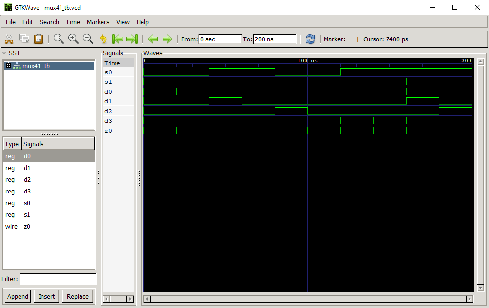

# MUX41 Multiplexer

## Definition
The multiplexer (MUX) is a combinational logic circuit designed to switch one of several input lines through to a single common output line. Data input selection is controlled by a set of select inpucts that determine which data input is gated to the output. 

This example designs a 4:1 multiplexer using logic gates. The signals are labeled in the following way:
* $$s_0, s_1$$: select inputs
* $$d_0, ..., d_3$$: data inputs
* $$z_0$$: data output

## Test Bench
| $$s_0$$| $$s_1$$| $$d_0$$| $$d_1$$| $$d_2$$| $$d_3$$| $$z_0$$|
|:---:   |:---:   |:---:   |:---:   |:---:   |:---:   |:---:   |
|       0|       0|       1|       0|       0|       0|       1|
|       0|       0|       0|       0|       0|       0|       0|
|       1|       0|       0|       1|       0|       0|       1|
|       1|       0|       0|       0|       0|       0|       0|
|       0|       1|       0|       0|       1|       0|       1|
|       0|       1|       0|       0|       0|       0|       0|
|       1|       1|       0|       0|       0|       1|       1|
|       1|       1|       0|       0|       0|       0|       0|
|       1|       0|       1|       1|       0|       1|       0|
|       1|       0|       0|       0|       1|       0|       1|

