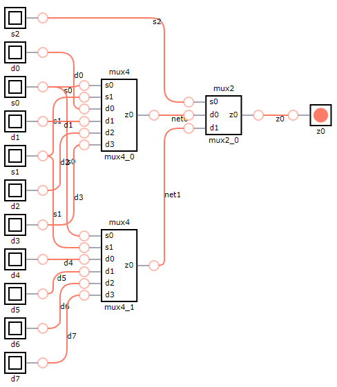
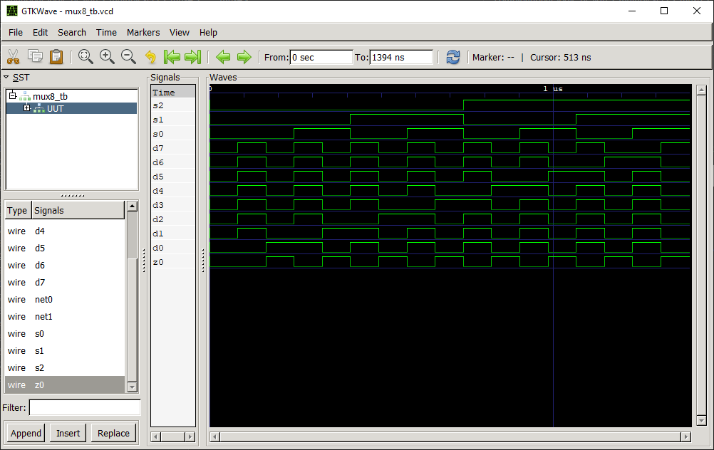
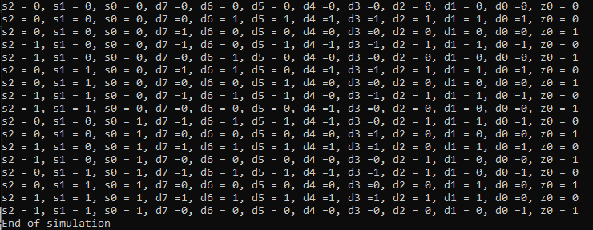

# MUX 8:1 Multiplexer

## Definition
The multiplexer (MUX) is a combinational logic circuit designed to switch one of several input lines through to a single common output line. Data input selection is controlled by a set of select inpucts that determine which data input is gated to the output. 

This example designs a 8:1 multiplexer using two 4:1 and one 2:1 multiplexers. This multiplexer consists of eight data input lines, three select lines and one output. The signals are labeled in the following way:
* s0, s1, s2: select inputs.
* d0, d1, d2, d3, d4, d5, d6, d7: data inputs.
* z0: data output.

### Truth Table
|s2 | s1 | s0 | d7 | d6 | d5 | d4 | d3 | d2 | d1 | d0 |z0 = f(s1,s0,d7,d6,d5,d4,d3,d2,d1,d0)|
|:---:|:---:|:---:|:---:|:---:|:---:|:---:|:---:|:---:|:---:|:---:|:---:|
|0| 0| 0| 0| x| x| x| x| x| x| x| 0|
|0| 0| 0| 1| x| x| x| x| x| x| x| 1|
|0| 0| 1| x| 0| x| x| x| x| x| x| 0|
|0| 0| 1| x| 1| x| x| x| x| x| x| 1|
|0| 1| 0| x| x| 0| x| x| x| x| x| 0|
|0| 1| 0| x| x| 1| x| x| x| x| x| 1|
|0| 1| 1| x| x| x| 0| x| x| x| x| 0|
|0| 1| 1| x| x| x| 1| x| x| x| x| 1|
|1| 0| 0| x| x| x| x| 0| x| x| x| 0|
|1| 0| 0| x| x| x| x| 1| x| x| x| 1|
|1| 0| 1| x| x| x| x| x| 0| x| x| 0|
|1| 0| 1| x| x| x| x| x| 1| x| x| 1|
|1| 1| 0| x| x| x| x| x| x| 0| x| 0|
|1| 1| 0| x| x| x| x| x| x| 1| x| 1|
|1| 1| 1| x| x| x| x| x| x| x| 0| 0|
|1| 1| 1| x| x| x| x| x| x| x| 1| 1|

## Test Bench

## Design
A modular design using two [MUX 4:1](../mux4/README.md) and one [MUX 2:1](../mux2/README.md) has been chosen to obtain the desired output.
