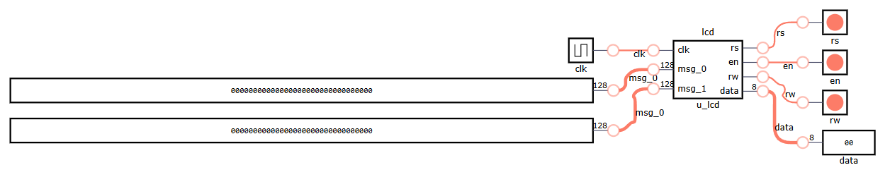

# Liquid Crystal Display

## Definition
This project interfaces an **LCM1602C LCD** with the **Icezum Alhambra** FPGA.
A **Liquid Crystal Display (LCD)** is a flat-panel display technology that uses liquid crystals to modulate light.
The **LCM1602C** is a 16x2 character LCD, meaning it can display two lines of 16 characters each.
The display requires specific initialization and data communication via control signals.

### LCD Control Pins
| Pin  | Input/Output | Description |
|------|-------------|-------------|
| `RS`  | Input  | Register Select (0: command, 1: data) |
| `RW`  | Input  | Read/Write control (always 0 for write) |
| `EN`  | Input  | Enable signal for LCD |
| `DATA[7:0]` | Output | 8-bit data bus for commands and characters |

### Wiring Diagram

## Module Functionality

The LCM1602C LCD uses control signals to write to the two rows.
First, a command sets the cursor position for each row (e.g., 0x80 for the first row, 0xC0 for the second).
Data is sent character by character in 8-bit or 4-bit mode, and the Register Select (RS) pin distinguishes between command and data modes.
The Enable (E) signal is crucial: it must be toggled from low to high to latch data into the LCD, signaling it to read from the data pins (D0-D7).
After a brief delay, the Enable signal goes low again, ensuring the LCD correctly registers the data or command.

### State Machine for LCD Control

The `next` state variable controls the sequence of LCD commands:

| State | RS  | Data (Hex) | Description |
|-------|-----|------------|-------------|
| 0     | 0   | `0x38`     | 8-bit mode |
| 1     | 0   | `0x0C`     | Display ON |
| 2     | 0   | `0x01`     | Clear display |
| 3     | 0   | `0x06`     | Entry mode |
| 4     | 0   | `0x80`     | Move cursor to first row |
| 5     | 1   | `msg_0`    | Write first line |
| 6     | 0   | `0xC0`     | Move cursor to second row |
| 7     | 1   | `msg_1`    | Write second line |

## Test Bench

## Design
A **frequency divider** [Frequency Divider](../../clock/freq_divider\README.md) module is used to generate a slower clock signal for the LCD.

