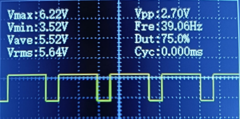
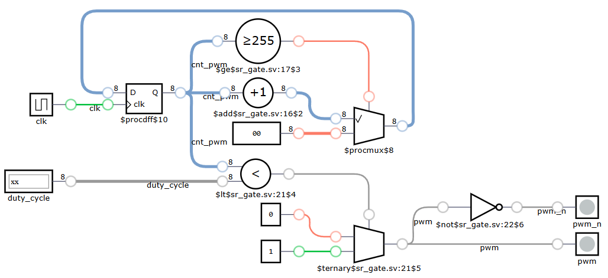
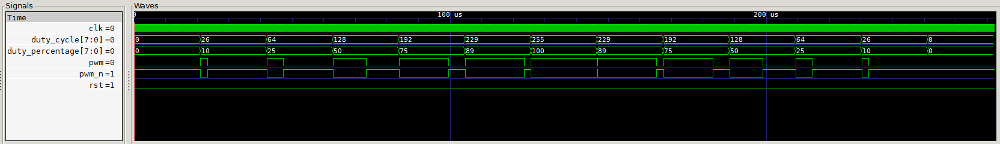

# Pulse Width Modulation (PWM) Generator

## Definition
This project implements a **PWM (Pulse Width Modulation) generator** using the iceZUM Alhambra FPGA. PWM is a technique used to control the power delivered to electrical devices by varying the duty cycle of a digital signal. It is commonly used in motor speed control, LED dimming, and power regulation.

The PWM generator module operates based on an 8-bit duty cycle input, producing a modulated output signal with complementary outputs.

## What is PWM?
Pulse Width Modulation (PWM) is a method of encoding information or controlling power by switching a signal between on and off states at a fixed frequency while varying the width of the "on" time. The **duty cycle** (expressed as a percentage) represents the proportion of time the signal stays high in each cycle:
- **0% Duty Cycle**: Always OFF
- **50% Duty Cycle**: Equal ON and OFF periods
- **100% Duty Cycle**: Always ON

## Module Functionality
The **pwm_gen** module generates a PWM signal with an adjustable duty cycle based on an 8-bit input.

### Inputs and Outputs
| Signal  | Direction | Description |
|---------|----------|-------------|
| `clk`   | Input  | Clock signal |
| `duty_cycle` | Input  | 8-bit duty cycle (0-255) |
| `pwm`  | Output  | PWM output signal |
| `pwm_n` | Output  | Complementary PWM signal |

## PWM Signal Generation
The module uses an **8-bit counter** that increments on every rising edge of the clock (`clk`). When the counter value is less than the specified `duty_cycle`, the output `pwm` is set HIGH; otherwise, it is set LOW. The complementary output (`pwm_n`) is the inverse of `pwm`.

## Test Bench

## Design
This module can be integrated with a **frequency divider** [Frequency Divider](../../clock/freq_divider/README.md) to adjust the PWM frequency by reducing the system clock rate.

