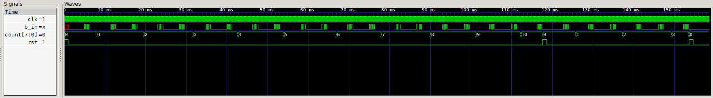

<h1 style="display: inline;">
  
Button Counter
</h1>

---

## Definition

This project implements a **parameterized digital counter** that increments its value upon **debounced button presses**. It is designed to work seamlessly with the [`button_debouncer`](./README.md) module to ensure that each physical press results in **only one count**, regardless of mechanical bounce.

This module supports:

- **Configurable bit width**
- **Customizable increment step**
- **Wraparound protection on overflow**
- **Integration-ready design** for use with FSMs, LEDs, or digital displays


---

## What is Button Counting?

In digital systems, buttons are often used as input devices for incrementing values such as scores, configuration options, or UI navigation. However, due to the **bouncing behavior** of mechanical switches, pressing a button without debouncing can lead to **multiple unintended increments**.

The `button_counter` module relies on a debounced signal (provided by `button_debouncer`) to increment a counter in **discrete, predictable steps**, making it ideal for reliable user interaction.

---

## Module

### Functional Description

The `button_counter` module monitors a **1-cycle pulse signal** (`b_out_pulse`) from a debouncer and increments an internal counter by a fixed `STEP`. If the counter reaches its maximum capacity, it **wraps around** to zero.

### Ports

| Signal   | Direction | Description                              |
| -------- | --------- | ---------------------------------------- |
| `clk`    | Input     | System clock                             |
| `rst`    | Input     | Active-high synchronous reset            |
| `b_in`   | Input     | Raw button signal (to be debounced)      |
| `count`  | Output    | Current counter value (parameterized)    |

### Parameters

| Parameter | Default | Description                          |
| --------- | ------- | ------------------------------------ |
| `WIDTH`   | `8`     | Bit width of the counter register    |
| `STEP`    | `8'd1`  | Value added per button press         |

---

## Test Bench



This testbench demonstrates how the counter reacts only to clean button pulses, ignoring any bouncing behavior from the mechanical switch. You can observe how the counter increments cleanly by `STEP`, resetting back to 0 when the limit is reached.

This predictable behavior ensures usability in real-world applications like LED toggling, game logic, or UI state stepping.

---

## Design

### Overview

#### 1. **Debounced Pulse Integration**

The `b_in` signal is passed to an instance of the `button_debouncer`, which filters out mechanical noise and delivers a **1-cycle clean pulse** (`b_out_pulse`) for each press.

#### 2. **Counting Logic**

The counter is only updated when a valid pulse is detected:

```verilog
if (rst)
    count <= 0;
else if (b_out_pulse)
    if (count > MAX_VAL - STEP)
        count <= 0;
    else
        count <= count + STEP;
```

This ensures that the counter always wraps properly and can be reused cyclically.

### Integration

The module is plug-and-play for any digital design that requires interaction through physical buttons. Parameterization makes it flexible and adaptable for a wide range of applications.

In this case, when the top module is loaded in the fpga, the LEDs on the same board will light up, signalling in binary coding the number of times the button has been pressed.

### Wiring Diagram


---

## Analysis

### Advantages

- ✅ **Clean Input Handling**: Uses a debounced pulse input to ensure one increment per press
- ✅ **Customizable Parameters**: Easily configure `WIDTH` and `STEP` values
- ✅ **Overflow Protection**: Wraps around without errors or undefined behavior

### Drawbacks

- ❌ **Dependency**: Requires `button_debouncer` module for correct operation
- ❌ **Synchronous Only**: Reset and logic are synchronous to `clk`; no async support
- ❌ **Fixed Wrap Behavior**: Always wraps to 0; not configurable unless modified manually

### Comments

- Use a **moderate frequency clock** (e.g., 500 Hz – 1 kHz) for smooth behavior in human-interactive scenarios
- Suitable for FSM triggers, user menu controls, or timed event configuration
- Integrate into display systems to visualize state transitions or counts
