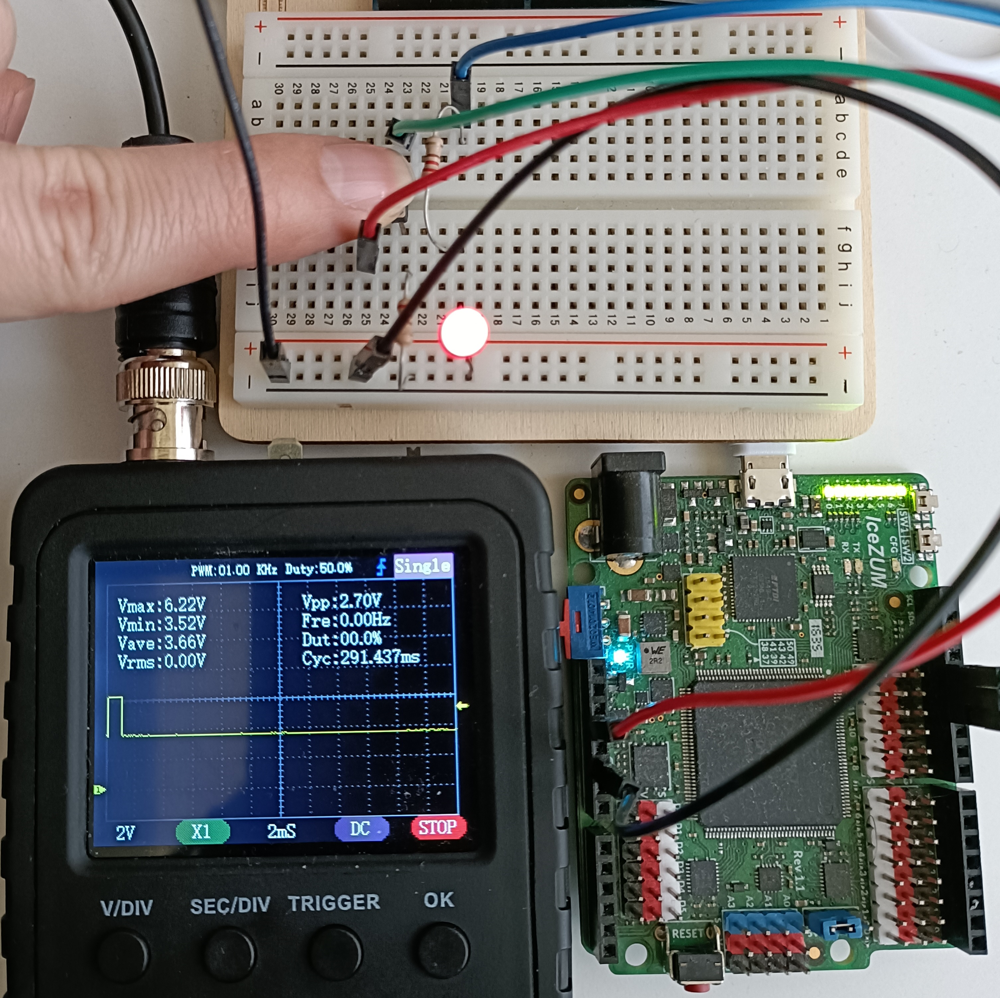
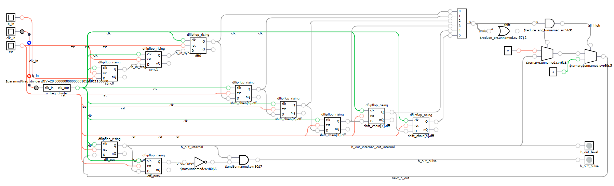
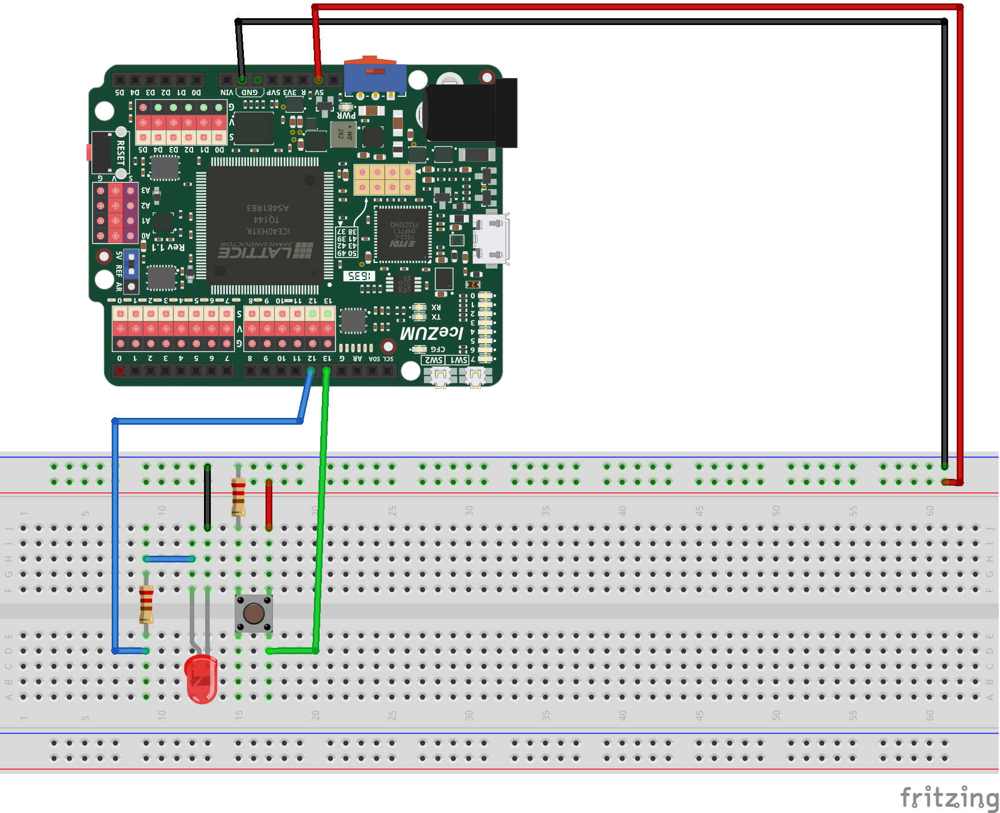
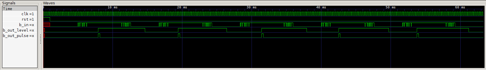

<h1 style="display: inline;">
  
Button Debouncer
</h1>



---

## Definition

This project implements a **robust digital button debouncer** for use in FPGA systems such as the iceZUM Alhambra. It mitigates the issue of **signal bouncing** caused by mechanical switches, ensuring clean, single-event detection of button presses and releases.

Unlike simpler edge-detection techniques, this design includes:

- **Synchronization** of asynchronous inputs
- **Debouncing via a shift register**
- **State stability checking**
- **1-cycle output pulse generation**

This approach ensures that the output is clean, glitch-free, and safe for digital processing systems.



---

## What is Button Debouncing?

Mechanical buttons introduce multiple fast transitions (bounces) when changing state. Without debouncing, a system may falsely detect **several presses** for a single user action.

Debouncing resolves this by observing the input over time. A change is only accepted once the new state has remained **stable for a predefined number of clock cycles**.

---

## Module Functionality

The `button_debouncer` module ensures both:

- A **clean level output** (`b_out_level`) that tracks the true stable state of the button.
- A **one-clock-cycle pulse** (`b_out_pulse`) each time the stable signal transitions to high (press detected).

### Inputs and Outputs

| Signal          | Direction | Description                                      |
| --------------- | --------- | ------------------------------------------------ |
| `clk`         | Input     | System clock (e.g., 400 Hz recommended)          |
| `rst`         | Input     | Active-high synchronous reset                    |
| `b_in`        | Input     | Raw (possibly bouncing) button input             |
| `b_out_level` | Output    | Debounced level signal                           |
| `b_out_pulse` | Output    | 1-cycle pulse on rising edge of debounced output |

### Wiring Diagram



---

## Test Bench



In the testbench you can see how we managed to obtain a stable output for each pulse, despite the observed oscillations. It is true that the output signal has a long delay with respect to the input signal, as will be discussed later.

However, for the applications that will be seen in this repository, this will not be a problem. In fact, taking as a reference the switching on of an LED, at the level of the human eye, we will not notice any delay when the LED lights up when the button is pressed.

---

## Design

### Overview

#### 1. **Input Synchronization**

A two-stage synchronizer (`sync0`, `sync1`) prevents metastability by aligning the asynchronous `b_in` signal to the system clock domain.

#### 2. **Debounce Filter (Shift Register)**

A **6-stage shift register** (implemented via `dflipflop_rising`) stores consecutive samples of the synchronized input. The output only changes if **all 6 bits are 1 or all 0**, meaning the signal has been stable for 6 clock cycles.

```verilog
wire all_high = &shift;      // All bits are 1 → stable HIGH
wire all_low  = ~|shift;     // All bits are 0 → stable LOW
```

#### 3. **Debounced Output Register**

A final flip-flop (`dff_out`) holds the actual debounced signal, updating only when stability conditions are met.

#### 4. **Edge Detection**

A trailing flip-flop (`dff_prev`) stores the previous debounced state. This allows generation of a **1-cycle pulse** on rising edge (`b_out_pulse`), useful for triggering events.

### Integration

This module uses a **custom D-type flip-flop module** named `dflipflop_rising`, which includes both `Q` and `nQ` outputs and supports synchronous reset. This is suitable for educational, pedagogical, or structured IP development.

> ⚠️ **Note**: Standard library flip-flops (e.g., `always @(posedge clk)` blocks in Verilog) can be used as alternatives for production or tool-optimized synthesis environments. The current implementation favors modularity and reuse.

---

## Analysis

### Advantages

- ✅ **Robustness**: Eliminates false triggers by enforcing strict stability checks.
- ✅ **Clean Interface**: Provides both level and pulse output, useful for FSMs or counters.
- ✅ **Clock-Domain Safety**: Synchronization reduces risk of metastability.
- ✅ **Portable Design**: Uses modular custom flip-flops (`dflipflop_rising`), making it reusable.

### Drawbacks

- ❌ **Latency**: Due to the 6-cycle stability check, the response is slightly delayed (e.g., at 400 Hz clock, debounce latency is ~15 ms).
- ❌ **Fixed Debounce Time**: Hardcoded number of shift stages; flexibility requires modifying HDL code.
- ❌ **Resource Use**: More flip-flops than simpler methods (e.g., monostable latches or counters).

### Comments

- Pair this module with **slower system clocks** (e.g., 100–500 Hz) to fine-tune debounce timing.
- Integrate `b_out_pulse` into **finite state machines (FSMs)** or **event counters** for edge-based control.
- Adjust shift register depth for faster or slower response.
