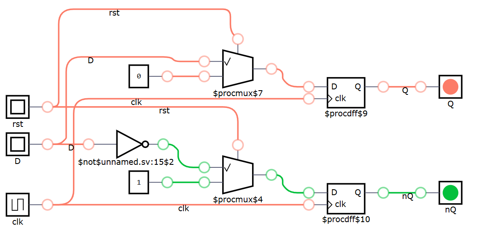
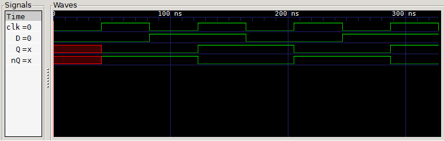

<h1 style="display: inline;">
  
  D Flip-Flop Rising Edge
</h1>

## Definition

This project implements a **D-type Flip-Flop** module with **rising edge triggering** and **active-high synchronous reset**. It is suitable for systems that require **stable storage of digital signals**, **signal synchronization**, or **simple edge-triggered behavior** such as registers, counters, or debouncers.

When the `clk` signal has a rising edge, the module samples the input `D` and assigns it to the output `Q`. If the reset (`rst`) is high during the rising edge, it overrides the input and sets the output to `0`.

Additionally, this module outputs `nQ`, the logical complement of `Q`, which is useful in combinational or sequential logic designs that benefit from having both polarities available.

---

## Module Functionality

### Ports

| Signal  | Direction | Description                                                                              |
| ------- | --------- | ---------------------------------------------------------------------------------------- |
| `clk` | Input     | System clock signal. Data is latched on the**rising edge**.                        |
| `rst` | Input     | **Active-high synchronous reset**. Forces `Q = 0` and `nQ = 1` on rising edge. |
| `D`   | Input     | Data input signal. Sampled on rising clock edge.                                         |
| `Q`   | Output    | Flip-flop output. Stores the value of `D` at rising edge of `clk`.                   |
| `nQ`  | Output    | Complement of `Q`. Always `~Q`.                                                      |

---

## Truth Table

| clk Edge  | `rst` | `D` | `Q` (next) | `nQ` (next) |
| --------- | ------- | ----- | ------------ | ------------- |
| No Edge   | 0       | X     | Hold         | Hold          |
| No Edge   | 1       | X     | Hold         | Hold          |
| ↑ Rising | 0       | 0     | 0            | 1             |
| ↑ Rising | 0       | 1     | 1            | 0             |
| ↑ Rising | 1       | X     | 0            | 1             |

---

## Test Bench

The testbench demonstrates correct behavior for normal clocked operation and reset scenarios. Key observations include:

- `Q` changes only on the rising edge of `clk`.
- When `rst` is asserted, `Q` and `nQ` are immediately forced to default values (`0` and `1` respectively) on the next clock edge.
- The complementary output `nQ` consistently reflects the inverse of `Q`.

---

## Design

While this module provides both `Q` and `nQ`, not all designs require the inverted output. If you only need `Q`, consider simplifying the design or ignoring `nQ` to reduce synthesis area.

---

## Analysis

### Advantages

- ✅ **Synchronous reset** avoids glitches common in asynchronous designs.
- ✅ **Dual output (`Q` and `nQ`)** simplifies some logic trees.
- ✅ **Compact and predictable** behavior for sequential logic chains.

### Limitations

- ❌ **No asynchronous behavior** (reset is synchronous).
- ❌ **Slightly higher logic usage** due to `nQ`.
