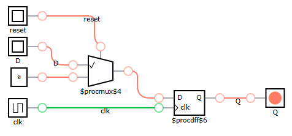
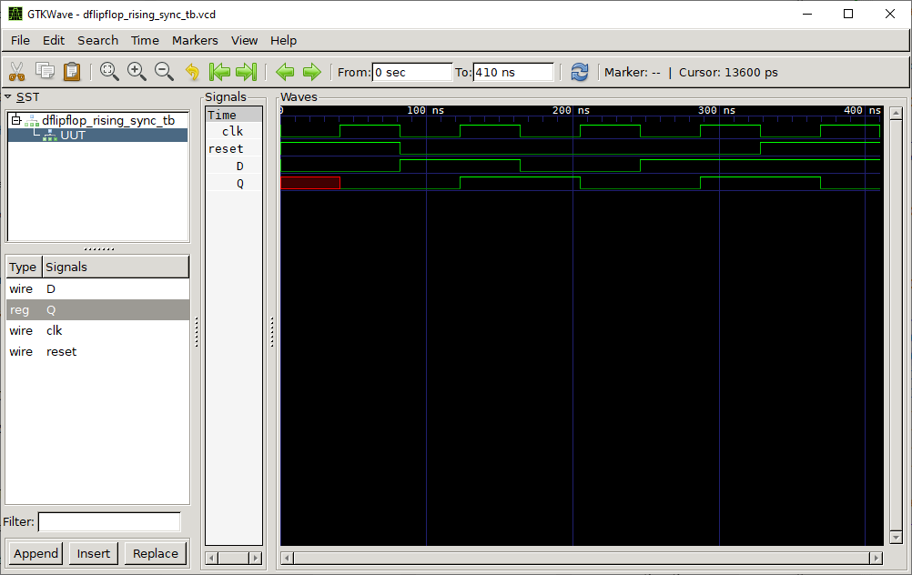

# D Flip-Flop Rising Edge Synchronization

## Definition
This module implements a D Flip-Flop with a rising edge clock and asynchronous reset signal.
This component stores the value of the `D` on the rising edge of the clock signal `clk`. When the reset signal is high,
it forces the output `Q` to `0`, regardless of the clock of input `D`.

### Inputs

* `clk`: Clock signal.
* `reset`: Asynchronous reset input
* `D`: Data input. This value is sampled on the rising edge of the `clk` signal.

### Output

* `Q`: Holds the value of `D` at the rising edge of the clock, unless reset is active.

### Truth Table
|clk | reset | D | Q |
|:---:|:---:|:---:|:---:|
|0| 0| 0| Q(no change)|
|0| 0| 1| Q(no change)|
|0| 1| 0| 0|
|0| 1| 1| 0|
|1 (↑)| 0| 0| 0|
|1 (↑)| 0| 1| 1|
|1 (↑)| 1| 0| 0|
|1 (↑)| 1| 1| 0|

## Test Bench

